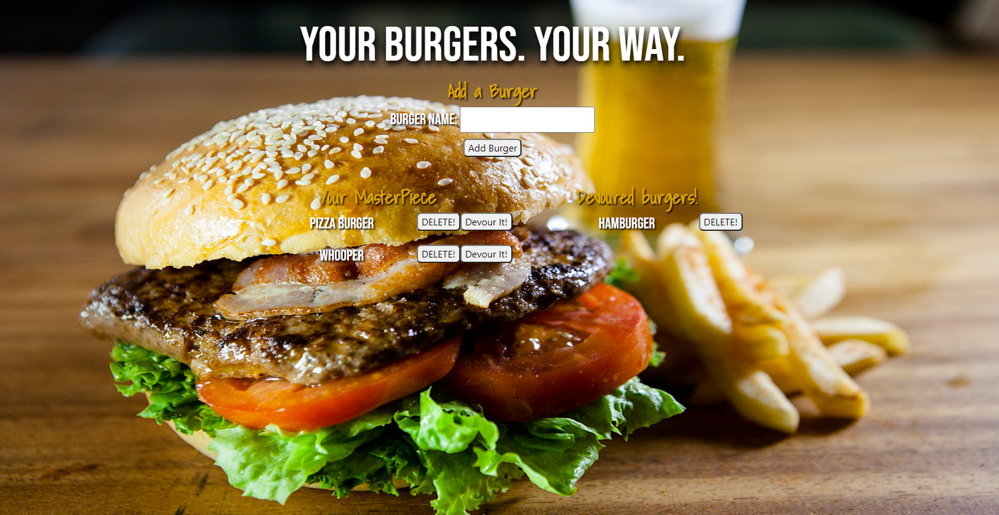

# Burger  

  ## Deployed link
  https://frozen-beyond-90766.herokuapp.com/

  ## Description 
  In this application the user will be able to add any burger to a database, also they can devour the burger with the push of a button.

 

  ## Table of Contents
  
  * [Installation](#installation)
  * [Usage](#usage)
  * [Credits](#credits)
  * [License](#license)
  * [Tests](#tests)
  * [Questions](#questions)
  
  ## Installation
  Run this to install
  <pre><code>npm i</code></pre>
  
  ## Usage
  After creating a database and running the schema and seeds files on the database, launch localhost with your port on the web browser

  ## Credits
  Contributors: Christian Marquez
  
  ## License
  This program is licensed under <code>MIT License</code>
  
  ## Contributing
  After forking this repository, contributions in the form of issues and pull requests are welcomed and encouraged.

  ## Tests
  To test this application, run the following command
  <pre><code></code></pre>

  ## Questions
  If there are any questions about this application,  
  please contact me through email at christianmarquez41@gmail.com   
  Github : https://github.com/tiroxxx
  
